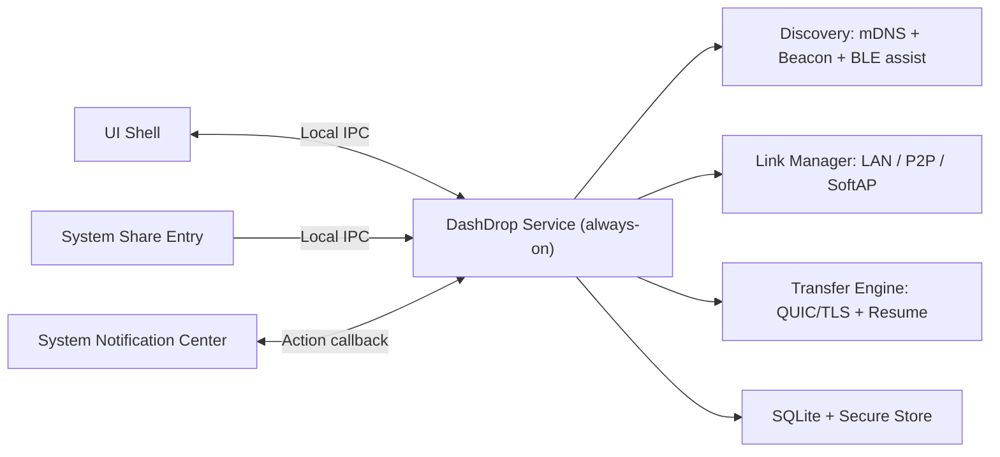

# DashDrop 无缝体验设计（AirDrop-like）

更新时间：2026-03-10  
状态：Proposed（目标态设计，非当前实现快照）

---

## 1. 目标定义

本设计目标是跨平台（macOS/Windows/Linux）实现接近 AirDrop 的体验：

1. 发送动作可从系统分享入口发起，不依赖主窗口预先打开。
2. 接收动作可通过系统通知完成（Accept/Decline）。
3. 发现、可达性、队列恢复由后台服务维护，不随窗口生命周期波动。
4. 同时支持 1:1 与 1:N，且失败可解释、可重试。
5. 在硬件能力受限（无蓝牙/无 Wi-Fi）时，LAN-only 仍可稳定可用。

设计边界：
1. 本文档是目标架构，不等价于当前 `main` 分支已交付能力。
2. 协议终态事件名保持稳定，不引入破坏式重命名。

---

## 2. SLO 与可验收定义

### 2.1 用户侧 SLO

1. Nearby 可见延迟（P50 <= 2s，P95 <= 5s）。
2. 从发送入口点击“发送”到接收端出现可操作通知（P50 <= 2s，P95 <= 6s）。
3. 已配对设备发送操作步数 <= 2。
4. 未配对设备发送操作步数 <= 3（含指纹确认）。

### 2.2 工程侧 SLO

1. 发现服务可用性 >= 99.9%。
2. 同网段、权限正常条件下端到端发送成功率 >= 99%。
3. 所有失败具备结构化 `reason_code + phase + detail`。

### 2.3 计量起点（强制）

为避免 SLO 无法验收，统一起点定义：

1. Nearby 可见延迟起点：`remote_peer_online_at`（远端 daemon 完成监听并注册发现通道）到 `local_device_visible_at`（本端 UI/daemon 首次产生该设备可见状态）。
2. 发送到通知延迟起点：`sender_dispatch_at`（发送请求进入调度器）到 `receiver_prompted_at`（接收端通知中心成功入队）。
3. 若通知权限被禁用，`receiver_prompted_at` 改为 `receiver_fallback_prompted_at`（托盘角标或前台队列可见）。

---

## 3. 现实约束与设计前提

1. 跨平台无法依赖 AWDL 私有协议，不追求底层完全复刻 AirDrop。
2. 单无线网卡设备上，SoftAP 常导致当前网络中断；不得静默切换。
3. mDNS/UDP 广播默认仅同网段有效；跨 VLAN/子网并非默认支持路径。
4. 企业设备可能被 MDM/GPO 禁用蓝牙、热点或组播，必须保留 LAN-only 路径。

---

## 4. 总体架构（目标态）

### 4.1 本地 IPC 规范（Phase A 必需）

传输通道：
1. macOS/Linux：Unix Domain Socket。
2. Windows：Named Pipe（`\\.\pipe\dashdrop-service-v1`）。

编码与帧：
1. 长度前缀 + CBOR（与传输协议一致的编码风格）。
2. Envelope：`proto_version`、`request_id`、`command`、`payload`、`auth_context`。

权限与认证：
1. 仅允许同用户会话连接（socket 权限 `0600` / pipe ACL 仅当前用户 SID）。
2. UI 与系统分享入口连接 daemon 时必须携带短时会话令牌（daemon 启动后生成，TTL 5 分钟，可刷新）。
3. 禁止匿名跨用户调用，禁止远程网络入口复用本地 IPC。

最小命令集：
1. `discover/list`, `discover/diagnostics`
2. `transfer/send`, `transfer/cancel`, `transfer/retry`
3. `trust/pair`, `trust/unpair`, `trust/set_alias`
4. `config/get`, `config/set`

文件授权：
1. macOS 必须通过 Security-Scoped Bookmarks 或等效授权句柄传递文件访问权限。
2. IPC 不接受“裸路径即默认可读”的假设。

---

## 5. 发现与建连策略

### 5.1 发现通道

1. 主通道：mDNS。
2. 兜底通道：UDP beacon（同网段广播）。
3. 辅助通道：BLE（仅用于近距唤醒与快速发现，不作为身份信任依据）。

### 5.2 跨子网边界

1. 默认不支持跨 VLAN/跨子网自动发现。
2. 诊断与 UI 必须明确提示：`当前网络可能存在 VLAN/子网隔离，请使用 Connect by Address`。

### 5.3 连接策略（默认）

1. 使用单发起方策略：Sender 发起连接，Receiver 仅监听。
2. 候选地址使用 Happy Eyeballs 思路并行尝试（受限并发），优先成功路径。
3. 默认优先级：LAN > P2P > SoftAP > Manual address。

### 5.4 Dual-active 策略结论

1. `Dual-active` 不作为主路径，不进入默认交付计划。
2. 如需研究，仅允许作为实验 feature flag，默认关闭，且不得影响主路径稳定性。

---

## 6. BLE / P2P / SoftAP 约束与规则

### 6.1 BLE 载荷规则（修订）

BLE 允许发送“短时加密会话胶囊（ephemeral capsule）”，但不得发送长期身份明文：

1. 可包含：`session_token`、短时链路参数、一次性公钥材料。
2. 不可包含：长期指纹明文、长期私密标识。
3. 最终身份判定仍以 QUIC/TLS 指纹校验为准。

### 6.2 SoftAP 凭据分发

1. SoftAP 凭据必须一次一密（随机 SSID + 强密码 + 短 TTL）。
2. 凭据通过加密胶囊分发：
   1. 优先 BLE（若可用）。
   2. BLE 不可用时使用二维码/短码交互确认。

### 6.3 SoftAP 用户确认（强制）

1. 禁止后台静默切换到 SoftAP。
2. 触发 SoftAP 前必须弹出明确确认：提示“可能短时断网”。
3. 用户拒绝后回退 LAN/manual，不可强制切换。

### 6.4 1:N 下 SoftAP 约束（强制）

1. 一台发送端同一时刻仅允许 1 个 SoftAP 目标会话。
2. 1:N 若多个目标都仅支持 SoftAP：必须串行调度。
3. 文案需提示用户“热点链路串行执行，预计耗时增加”。

---

## 7. 安全与信任策略

### 7.1 身份校验

1. 发送侧：强绑定 `selected_fp == cert_fp`。
2. 接收侧目标策略（v0.2+）：在可确定预期身份时，`mdns_fp != cert_fp` 走硬拒绝；无法确定预期身份时至少强告警 + 审计。
3. 当前实现（v0.1.x）允许“告警不拒绝”的兼容路径，属于过渡态，不应作为长期目标。

### 7.2 自动接收策略（修订）

不允许“完全静默自动接收”。Trusted 场景也必须满足：

1. 必须产生通知或可见前台队列提示。
2. 默认存在单次体积上限（例如 500MB，可配置）。
3. 可执行/脚本类高风险文件默认仍需人工确认。

### 7.3 配对策略

1. 保持 TOFU 兼容，但默认引导带外验证（二维码/短码）。
2. 配对关系支持冻结、撤销、风险告警闭环。

---

## 8. 传输模型（1:1 与 1:N）

### 8.1 任务模型

1. `batch_id`：一对多任务分组标识。
2. `transfer_id`：每目标独立传输任务。
3. 每目标独立状态、独立失败原因、独立重试。

### 8.2 1:N I/O 策略（避免过载）

1. 同一源文件在发送侧应支持“单读多发”扇出（fan-out）策略，避免 N 份重复磁盘读取。
2. 全局并发上限 + 单目标并发上限同时生效。
3. 若系统资源紧张，优先降并发，不允许拖垮前台交互。

### 8.3 状态契约

1. 终态事件命名保持不变。
2. 新增字段仅作为可选扩展，不破坏已有前端消费契约。

---

## 9. 通知与降级体验

### 9.1 正常路径

1. 接收通知包含发送方、文件规模、信任状态。
2. 通知支持 `Accept/Decline` 直接动作。

### 9.2 通知不可用降级（强制）

当通知权限被禁用或系统通知失败时：

1. 托盘/菜单栏角标必须提示 pending 请求。
2. 前台 `Incoming Queue` 必须高优先显示。
3. 发送侧错误文案必须明确“对端通知不可达或未响应”。

---

## 10. 诊断与可观测性

诊断输出必须可区分“发现失败 / 可达性失败 / 协议失败 / 权限失败”：

1. 发现层：mDNS/beacon 事件计数、失败计数、接口策略、浏览器重启状态。
2. 链路层：listener 模式、链路能力、当前链路模式、fallback 次数。
3. 设备层：每设备 resolve 原始地址数/可用地址数、probe 结果、最近失败分类。
4. 交互层：通知权限状态、通知降级触发计数。
5. 传输层：phase 级失败统计与可重试建议。

---

## 11. 分阶段实施计划（修订后）

### Phase A：系统化底座

1. Daemon + UI 拆分。
2. 本地 IPC 协议、认证、权限模型落地。
3. 文件授权句柄（Security-Scoped Bookmarks 等）接线。

### Phase B：系统入口与通知闭环

1. Finder/Explorer 分享入口。
2. 通知动作回调。
3. 通知不可用降级链路（托盘/前台队列）。

### Phase C：信任与安全收敛

1. 带外配对（二维码/短码）。
2. Trusted 自动接收安全护栏。
3. 接收侧 mismatch 策略升级（从告警过渡到严格模式）。

### Phase D：可靠性与恢复

1. 断点续传。
2. 队列持久化恢复。
3. 失败原因分层与可重试策略完善。

### Phase E：兼容性与灰度基础设施（提前）

1. 硬件/驱动兼容矩阵。
2. Feature flag 与灰度开关。
3. 平台级失败码监控。

### Phase F：Wi-Fi 直连能力上线

1. P2P/SoftAP 能力探测与调度。
2. SoftAP 用户确认与串行限制。
3. 链路切换诊断与回退策略。

### Phase G：1:N 深化与性能优化

1. 扇出读写优化（单读多发）。
2. 1:N 调度、限流、失败重试 UX 完整化。

### Phase H：实验项（默认关闭）

1. 研究型连接策略（如 dual-active 实验）。
2. 必须在 feature flag 下灰度，不影响默认主路径。

---

## 12. 风险与边界

1. 跨公网中继/NAT 穿透不在本设计范围。
2. 跨 VLAN 自动发现默认不保证。
3. P2P/SoftAP 在不同平台 API 与驱动差异大，需灰度发布。
4. 单网卡设备热点链路体验存在天然上限，必须显式告知用户。

---

## 13. Definition of Done（AirDrop-like 门槛）

仅当以下条件全部满足，才可对外宣称“AirDrop-like”：

1. 系统分享入口直达发送。
2. 通知动作直达接收，且通知禁用时有可用降级。
3. 配对与安全策略可解释，不存在静默高风险路径。
4. 1:1 与 1:N 都有稳定可重试与可诊断闭环。
5. 在受限设备能力下，LAN-only 仍保持稳定可用。
