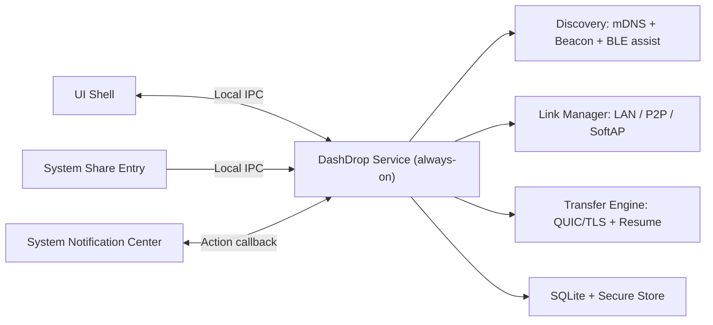

# DashDrop 无缝体验设计（AirDrop-like）

更新时间：2026-03-11  
状态：Proposed（目标态设计，非当前实现快照；其中部分约束已提前在 `main` 落地）

---

## 1. 目标定义

本设计目标是跨平台（macOS/Windows/Linux）实现接近 AirDrop 的体验：

1. 发送动作可从系统分享入口发起，不依赖主窗口预先打开。
2. 接收动作可通过系统通知完成（Accept/Decline）。
3. 发现、可达性、队列恢复由后台服务维护，不随窗口生命周期波动。
4. 同时支持 1:1 与 1:N，且失败可解释、可重试。
5. 在硬件能力受限（无蓝牙/无 Wi-Fi）时，LAN-only 仍可稳定可用。

设计边界：
1. 本文档是目标架构，不等价于当前 `main` 分支已交付能力。
2. 协议终态事件名保持稳定，不引入破坏式重命名。
3. 不以私有 AWDL 协议为前提，所有策略需可在通用系统 API 下实现。

当前 `main` 已提前落地的相关约束（2026-03-11）：
1. 固定 QUIC 端口 `53319/udp` 优先，端口占用时 fallback 随机端口，并输出 `listener_port_mode/firewall_rule_state` 诊断。
2. 通知过期动作已在当前单进程实现中返回 `E_REQUEST_EXPIRED`，且保持终态事件命名不变。
3. 恢复前 `source_snapshot(size/mtime/head_hash)` 一致性校验已实现，不一致时整文件重传。
4. 发现层已按电源状态调整 beacon 频率，并暴露相关诊断字段。
5. 传输事件与历史已支持可选 `batch_id` 扩展字段，老版本可忽略。

---

## 2. SLO 与可验收定义

### 2.1 用户侧 SLO

说明：以下 SLO 基准默认以交流电模式计量；电池模式为节能优先，Nearby 可见延迟目标放宽为 `P95 <= 15s`。

1. Nearby 可见延迟（P50 <= 2s，P95 <= 5s）。
2. 从发送入口点击“发送”到接收端出现可操作通知（P50 <= 2s，P95 <= 6s）。
3. 已配对设备发送操作步数 <= 2。
4. 未配对设备发送操作步数 <= 3（含指纹确认）。

### 2.2 工程侧 SLO

1. 发现服务可用性 >= 99.9%。
2. 同网段、权限正常条件下端到端发送成功率 >= 99%。
3. 所有失败具备结构化 `reason_code + phase + detail`。
4. 1:N 模式下单目标失败不影响其他目标完成。

### 2.3 计量起点（强制）

1. Nearby 可见延迟起点：`remote_peer_online_at`（远端 daemon 已监听且注册发现通道）到 `local_device_visible_at`（本端首次可见该设备）。
2. 发送到通知延迟起点：`sender_dispatch_at`（发送请求进入调度器）到 `receiver_prompted_at`（接收端通知中心成功入队）。
3. 若通知权限被禁用，`receiver_prompted_at` 改为 `receiver_fallback_prompted_at`（托盘角标或前台 pending 队列可见）。

---

## 3. 现实约束与设计前提

1. 跨平台无法依赖 AWDL 私有协议，不追求底层完全复刻 AirDrop。
2. 单无线网卡设备上，SoftAP 常导致当前网络中断；不得静默切换。
3. mDNS/UDP 广播默认仅同网段有效；跨 VLAN/子网并非默认支持路径。
4. 企业设备可能被 MDM/GPO 禁用蓝牙、热点或组播，必须保留 LAN-only 路径。
5. 系统通知存在“滞后点击”现实，必须处理通知过期后的动作幂等。

---

## 4. 总体架构（目标态）

### 4.1 本地 IPC 规范（Phase A 必需）

传输通道：
1. macOS/Linux：Unix Domain Socket。
2. Windows：Named Pipe（`\\.\\pipe\\dashdrop-service-v1`）。

编码与帧：
1. 长度前缀 + CBOR。
2. Envelope：`proto_version`、`request_id`、`command`、`payload`、`auth_context`。

权限与认证：
1. 仅允许同用户会话连接（socket 权限 `0600` / pipe ACL 仅当前用户 SID）。
2. UI 与系统分享入口连接 daemon 时必须携带短时访问令牌 `access_token`（TTL 5 分钟）。
3. 访问令牌由 daemon 发放并只保存在 daemon 内存，UI 不做磁盘持久化。
4. 刷新机制：UI 每 2 分钟主动刷新；daemon 返回新 token 并吊销旧 token。
5. UI 重启行为：必须重新走本地认证握手，获取新 token；不可复用旧进程 token。

最小命令集：
1. `discover/list`, `discover/diagnostics`
2. `transfer/send`, `transfer/cancel`, `transfer/retry`
3. `trust/pair`, `trust/unpair`, `trust/set_alias`
4. `config/get`, `config/set`

### 4.2 文件授权句柄（macOS 必需）

1. UI 在用户交互上下文中获取 Security-Scoped Bookmark Data。
2. IPC 采用方案 A：Bookmark 二进制放入 CBOR payload（base64 字段）传给 daemon。
3. daemon 使用 Bookmark 恢复安全访问并在传输结束后释放权限。
4. 不使用“仅路径字符串”的授权假设。
5. 非 macOS 平台可传绝对路径，但需满足本地 ACL 校验。

---

## 5. 发现与建连策略

### 5.1 发现通道

1. 主通道：mDNS。
2. 兜底通道：UDP beacon（同网段广播）。
3. 辅助通道：BLE（仅用于近距唤醒与快速发现，不作为身份信任依据）。

### 5.2 跨子网边界

1. 默认不支持跨 VLAN/跨子网自动发现。
2. 诊断与 UI 必须提示：`当前网络可能存在 VLAN/子网隔离，请使用 Connect by Address`。

### 5.3 连接策略（默认）

1. 使用单发起方策略：Sender 发起连接，Receiver 仅监听。
2. 候选地址采用“并行地址竞速（concurrent address racing）”，受全局并发上限约束。
3. 默认优先级：LAN > P2P > SoftAP > Manual address。

### 5.4 监听端口与防火墙策略（Windows 关键约束）

1. QUIC listener 优先固定端口 `53319/udp`。
2. 固定端口被占用时，才 fallback 到随机端口并记录诊断字段 `listener_port_mode=fallback_random`。
3. 安装器/首次提权初始化必须注册防火墙规则：
   1. `dashdrop.exe` 入站 UDP 允许（进程级）
   2. 固定端口 `53319/udp` 允许
   3. 发现端口 `5353/udp`、`53318/udp` 按策略引导
4. 非管理员安装场景（无法写系统防火墙规则）必须降级处理：
   1. 首次启动给出明确引导（需用户在系统防火墙弹窗中允许，或手动添加规则）
   2. 诊断输出标记 `firewall_rule_state=user_scope_unmanaged`
   3. 禁止宣称“后台静默可达”，需明确该场景可用性取决于用户授权结果

### 5.5 Dual-active 策略结论

1. `Dual-active` 不作为主路径，不进入默认交付计划。
2. 仅允许作为实验 feature flag（默认关闭），且不得影响主路径稳定性。

---

## 6. BLE / P2P / SoftAP 约束与规则

### 6.1 BLE 载荷规则

BLE 允许发送“短时加密会话胶囊（ephemeral capsule）”，但不得发送长期身份明文：

1. 可包含：`session_token`、短时链路参数、一次性公钥材料。
2. 不可包含：长期指纹明文、长期私密标识。
3. 最终身份判定仍以 QUIC/TLS 指纹校验为准。
4. BLE 广播标识需轮换（rolling identifier），避免长期可追踪。
5. 轮换周期建议 `5-15` 分钟，并允许在新会话建立后提前轮换；切换窗口内需做短时关联去抖，避免同设备重复发现抖动。

### 6.2 SoftAP 凭据分发

1. SoftAP 凭据必须一次一密（随机 SSID + 强密码 + 短 TTL）。
2. 凭据分发：
   1. 优先 BLE 加密胶囊。
   2. BLE 不可用时使用二维码/短码交互确认。

### 6.3 SoftAP 用户确认（强制）

1. 禁止后台静默切换到 SoftAP。
2. 触发 SoftAP 前必须弹出确认：提示“可能短时断网”。
3. 用户拒绝后回退 LAN/manual，不可强制切换。

### 6.4 1:N 下 SoftAP 约束（强制）

1. 一台发送端同一时刻仅允许 1 个 SoftAP 目标会话。
2. 1:N 若多个目标仅支持 SoftAP：必须串行调度。
3. 文案必须提示用户“热点链路串行执行，预计耗时增加”。

---

## 7. 安全与信任策略

### 7.1 身份校验

1. 发送侧：强绑定 `selected_fp == cert_fp`。
2. 接收侧目标策略（v0.2+）：可确定预期身份时，`mdns_fp != cert_fp` 走硬拒绝。
3. 当前实现（v0.1.x）允许“告警不拒绝”的兼容路径，属于过渡态。

### 7.2 自动接收策略

不允许“完全静默自动接收”。Trusted 场景必须满足：

1. 必须产生通知或可见前台队列提示。
2. 默认存在单次体积上限（例如 500MB，可配置）。
3. 可执行/脚本类高风险文件默认仍需人工确认。

高风险文件分类规则（当前 `codex/phase3-security` 已按此落地，接收端缺省回退先按文件名后缀判定）：
1. 一级：可执行与脚本扩展名（如 `.exe/.msi/.bat/.cmd/.ps1/.sh/.zsh/.bash/.app/.pkg/.deb/.rpm`）。
2. 二级：无扩展但含可执行 shebang（`#!`）或可执行权限位。
3. 三级：普通文档/媒体。

协议承载策略：
1. `FileItem` 维持兼容字段不变。
2. 新增可选字段 `risk_class`（`high|normal`），老版本可忽略。
3. 若对端未提供 `risk_class`，接收端按本地文件名与策略回退判定。

### 7.3 体积上限超限行为

1. Trusted 自动接收场景下，若超过上限：降级为“必须人工确认”，不是静默拒绝。
2. 当前实现选择统一保持 `E_TIMEOUT` 语义；`E_SIZE_POLICY` 保留给未来显式策略拒绝分支。
3. 发送端错误文案必须明确“超出自动接收策略阈值”。

### 7.4 配对策略

1. 保持 TOFU 兼容，但默认引导带外验证（二维码/短码）。
2. 配对关系支持冻结、撤销、风险告警闭环。

---

## 8. 传输模型与性能可靠性

### 8.1 任务模型

1. `batch_id`：一对多任务分组标识。
2. `transfer_id`：每目标独立传输任务。
3. 每目标独立状态、独立失败原因、独立重试。

### 8.2 断点恢复一致性（防混流）

恢复前必须执行源文件一致性校验快照：

1. 发送任务创建时记录 `source_snapshot`：
   1. `size`
   2. `mtime`
   3. `head_hash`（文件前 `min(1MiB, file_size)` 的 BLAKE3）
2. 恢复时若任一字段不一致：
   1. 丢弃旧块进度
   2. 从头重传
   3. 记录 `resume_source_changed` 诊断事件

### 8.3 进度持久化写放大控制（SQLite）

1. 块进度先写内存。
2. 批量落盘触发条件：
   1. 每 3 秒一次，或
   2. 新增进度 >= 32MB
3. SQLite 必须使用 WAL + 单写线程，避免并发写锁抖动。
4. 崩溃恢复允许丢失最近一个批次窗口（最多约 3 秒进度）。

### 8.4 1:N 扇出（单读多发）实现约束

1. 拆分 Reader 与 Writer：
   1. 单 Reader 顺序读取块
   2. N 个目标 Writer 订阅同一块流
2. 使用有界缓冲队列（bounded ring buffer）控制内存上限。
3. 慢目标触发背压，不得拖垮全局；允许按目标降速或短时隔离。

### 8.5 状态契约

1. 终态事件命名保持不变。
2. 新增字段仅作为可选扩展，不破坏已有前端消费契约。

---

## 9. 通知生命周期与降级体验

### 9.1 正常路径

1. 接收通知包含发送方、文件规模、信任状态。
2. 通知支持 `Accept/Decline` 直接动作。

### 9.2 通知过期与僵尸点击保护

1. 每条通知绑定 `transfer_id + notification_id`。
2. 当以下任一条件发生，daemon 必须主动撤回或标记通知为“已过期”：
   1. 接收超时
   2. 发送方取消
   3. 任务已终态
3. 对过期通知点击动作统一返回 `E_REQUEST_EXPIRED`，不得重新发起无效握手。

### 9.3 通知不可用降级（强制）

当通知权限被禁用或系统通知失败时：

1. 托盘/菜单栏角标必须提示 pending 请求。
2. 前台 `Incoming Queue` 必须高优先显示。
3. 发送侧错误文案必须明确“对端通知不可达或未响应”。

---

## 10. 能耗、隐私与可观测性

### 10.1 后台广播节能策略

1. 交流电模式：beacon 维持标准频率（例如 3 秒）。
2. 电池模式：降频（例如 10-15 秒）。
3. 低电量模式：进一步降频或暂停主动广播，仅保留被动监听。
4. 系统休眠前暂停广播，唤醒后快速恢复。

### 10.2 广播隐私

1. BLE 广播使用轮换标识，禁止长期固定可追踪标识。
2. 发现层暴露字段遵循最小必要原则。

### 10.3 监控语义（本地优先）

1. Phase E 的“监控”默认指本地统计与诊断导出，不默认启用云遥测。
2. 若启用遥测，必须显式用户同意（opt-in）并可随时关闭。

### 10.4 诊断输出要求

诊断输出必须可区分“发现失败 / 可达性失败 / 协议失败 / 权限失败”：

1. 发现层：mDNS/beacon 事件计数、失败计数、接口策略、浏览器重启状态。
2. 链路层：listener 模式、链路能力、当前链路模式、fallback 次数。
3. 设备层：每设备 resolve 原始地址数/可用地址数、probe 结果、最近失败分类。
4. 交互层：通知权限状态、通知降级触发计数、过期通知点击计数。
5. 传输层：phase 级失败统计与可重试建议。

---

## 11. 分阶段实施计划（修订后）

### Phase A：系统化底座

1. Daemon + UI 拆分。
2. 本地 IPC 协议、认证、权限模型落地。
3. 文件授权句柄（Security-Scoped Bookmarks 等）接线。

### Phase B：系统入口与通知闭环

1. Finder/Explorer 分享入口。
2. 通知动作回调。
3. 通知不可用降级链路（托盘/前台队列）。
4. 通知过期撤回与 `E_REQUEST_EXPIRED` 闭环。

### Phase C：信任与安全收敛

1. 带外配对（二维码/短码）。
2. Trusted 自动接收安全护栏（体积上限、高风险文件人工确认）。
3. 接收侧 mismatch 策略升级（从告警过渡到严格模式）。

### Phase D：可靠性与恢复

1. 断点续传。
2. 源文件一致性快照校验（防混流）。
3. SQLite 批量进度落盘策略。

### Phase E：兼容性与灰度基础设施（提前）

1. 硬件/驱动兼容矩阵。
2. Feature flag 与灰度开关。
3. 本地指标与诊断体系（可选遥测另行 opt-in）。
4. BLE 能力探测基线与平台可用性分层。

### Phase F：Wi-Fi 直连能力上线

1. P2P/SoftAP 能力探测与调度。
2. BLE 加密胶囊分发链路参数（无 BLE 则二维码/短码回退）。
3. SoftAP 用户确认与 1:N 串行限制。
4. 固定端口优先与防火墙策略联动。

### Phase G：1:N 深化与性能优化

1. 扇出读写优化（单读多发）。
2. 1:N 调度、限流、失败重试 UX 完整化。
3. 背压与资源隔离策略。

### Phase H：实验项（默认关闭）

1. 研究型连接策略（如 dual-active 实验）。
2. 必须在 feature flag 下灰度，不影响默认主路径。

---

## 12. 风险与边界

1. 跨公网中继/NAT 穿透不在本设计范围。
2. 跨 VLAN 自动发现默认不保证。
3. P2P/SoftAP 在不同平台 API 与驱动差异大，需灰度发布。
4. 单网卡设备热点链路体验存在天然上限，必须显式告知用户。
5. 无通知权限场景必须降级，不能宣称“完全无感接收”。

---

## 13. Definition of Done（AirDrop-like 门槛）

仅当以下条件全部满足，才可对外宣称“AirDrop-like”：

1. 系统分享入口直达发送。
2. 通知动作直达接收，且通知禁用时有可用降级。
3. 配对与安全策略可解释，不存在静默高风险路径。
4. 1:1 与 1:N 都有稳定可重试与可诊断闭环。
5. 在受限设备能力下，LAN-only 仍保持稳定可用。
