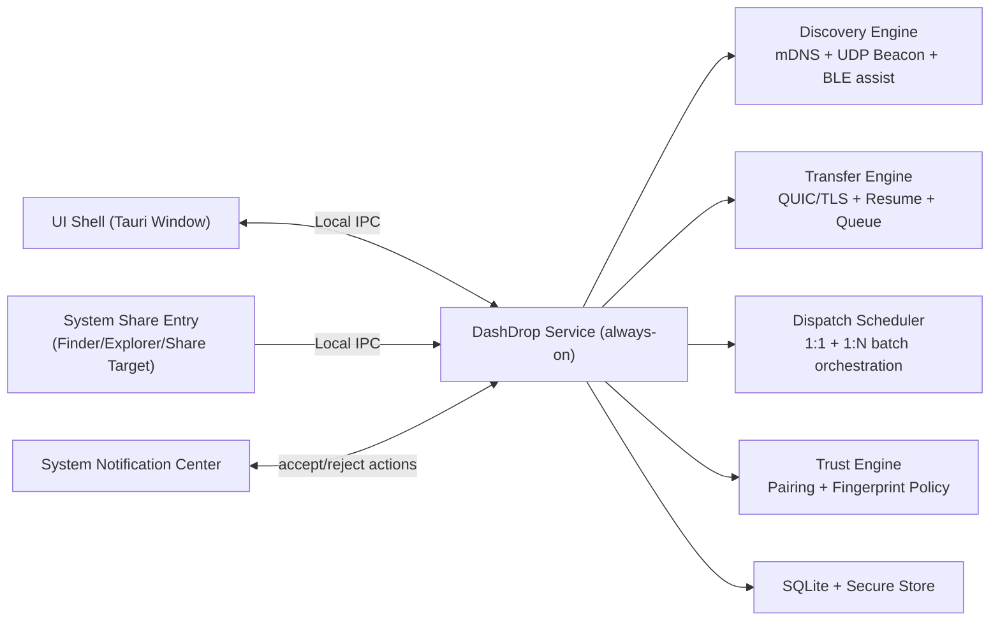

# DashDrop 无缝体验设计（AirDrop-like）

更新时间：2026-03-10  
状态：Proposed（面向下一阶段实施）

---

## 1. 目标定义

本设计的目标不是“像 LocalSend 一样能传文件”，而是尽可能实现接近 AirDrop 的无缝体验：

1. 发送动作发生在系统上下文，不要求先打开主应用。
2. 接收动作通过系统通知即可完成，不要求切换到主界面。
3. 设备发现与可用性由后台常驻服务维护，不依赖前台窗口生命周期。
4. 对可信设备做到低摩擦直达，对未知设备保持安全确认。
5. 网络抖动与短时中断可自动恢复，用户无需重复操作。
6. 同时支持一对一与一对多（批量下发）两类传输模式，且体验一致。

---

## 2. “无缝”体验标准（体验契约）

### 2.1 用户侧 SLO

1. 同网段设备可见延迟：P50 <= 2s，P95 <= 5s。
2. 从“系统分享”到“对端收到可操作通知”延迟：P50 <= 2s，P95 <= 6s。
3. 已配对设备发送步骤：不超过 2 步（选择设备 -> 发送）。
4. 未配对设备发送步骤：不超过 3 步（选择设备 -> 指纹确认 -> 发送）。
5. 网络恢复后设备在线状态恢复：<= 8s（无需重启应用）。
6. 一对多（<= 5 个目标）批量发起时间：P95 <= 3s（完成目标选择到任务进入进行中）。

### 2.2 工程侧 SLO

1. 后台常驻发现可用性：>= 99.9%（进程级健康自恢复）。
2. 传输成功率（同网段、目标在线、权限正常）：>= 99%。
3. 接收确认超时与失败均可解释（可操作文案 + 诊断字段）。
4. 无“静默失败”：任意失败路径必须沉淀可追踪 reason_code 与 phase。
5. 一对多任务中单目标失败不拖垮整体任务，支持按目标重试。

---

## 3. 关键差距（当前实现 -> AirDrop-like）

当前已具备：QUIC 加密传输、mDNS + beacon 发现、基本配对与探活、诊断导出。  
关键差距在“系统级产品形态”而非单点协议能力：

1. 缺少常驻后台服务（UI 进程退出后发现和接收能力下降）。
2. 缺少系统分享入口（Finder/Explorer/Share Target）。
3. 缺少通知级接收动作（Accept/Reject 在通知中心直接处理）。
4. 缺少带外配对（TOFU 仍需升级为可验证配对）。
5. 缺少断点续传与后台队列恢复。
6. 缺少一对多批量发送模型（当前以单目标发送为主）。
7. 缺少 BLE 能力探测与跨硬件差异处理策略。

---

## 4. 总体架构（目标态）

### 4.1 架构原则

1. 传输与发现必须以后台 service 为真源（source of truth）。
2. UI 仅做控制面和可视化，不承载关键网络状态机。
3. 所有入口（主界面、系统分享、右键菜单）都走同一服务 API。
4. 协议与状态事件向后兼容，终态事件命名保持稳定。
5. 调度层必须同时支持 1:1 与 1:N，且复用同一状态机与诊断体系。

---

## 5. 平台集成设计

### 5.1 macOS

1. 菜单栏常驻（Menu Bar）+ 登录启动（LaunchAgent）。
2. Finder 分享入口（Share Extension / Quick Action）。
3. 接收通知支持 action button：`Accept` / `Decline`。
4. 权限模型：
   1. Local Network（Bonjour/mDNS）
   2. Notifications
   3. 文件访问（用户选择路径范围）

### 5.2 Windows

1. 托盘常驻 + 开机启动。
2. Explorer 右键发送入口（Shell Extension/Context Menu）。
3. Windows Notification with actions（Toast action callbacks）。
4. 防火墙规则引导：
   1. mDNS: UDP 5353
   2. Beacon: UDP 53318
   3. QUIC listener: 随机 UDP 端口（应用进程）

### 5.3 Linux（阶段性）

1. 托盘常驻 + autostart `.desktop`。
2. 文件管理器入口优先支持常见桌面环境（Nautilus/Dolphin）。
3. 通知动作依赖 Desktop Notifications 能力矩阵，先提供统一降级路径。

---

## 6. 发现链路设计（Seamless Discovery）

### 6.1 双通道策略

1. 主通道：mDNS（设备身份 + 会话信息 + 端口）。
2. 兜底通道：UDP beacon（组播受限时保持可见性）。
3. 统一会话模型：`sessions[session_id]` 聚合，同一 fingerprint 合并显示。

### 6.2 地址与可达性策略

1. 地址候选来自所有 session，按最新 session 优先，IPv4 优先，IPv6 作为后备。
2. Probe 采用轻量 QUIC preflight，不触发业务传输状态机。
3. 降级规则：
   1. 单次 probe 失败不立刻判离线。
   2. 连续失败阈值后进入 `offline_candidate`。
   3. session 全失活 + 宽限期后进入 `offline`。

### 6.3 浏览器自恢复

1. `Timeout` 视为正常 idle，不中断。
2. `Disconnected` 触发 browse 重建，指数退避（上限 5s）。
3. 重建状态写入 diagnostics：`active/restart_count/last_disconnect_at`。

### 6.4 BLE 辅助发现（跨硬件兼容）

BLE 的角色定义：仅做“近距快速发现/唤醒”，不作为唯一发现通道，不承载身份信任结论。

1. 启动时执行 BLE 能力探测：
   1. `ble_adapter_present`
   2. `ble_scan_supported`
   3. `ble_advertise_supported`
   4. `ble_permission_granted`
2. 运行策略：
   1. 能力完整：启用 BLE 扫描+广播辅助发现。
   2. 仅扫描可用：只启用扫描，广播关闭。
   3. BLE 不可用/被禁：自动降级到 mDNS + beacon。
3. 安全约束：
   1. BLE payload 只放临时会话标识，不放长期身份明文。
   2. 最终身份仍以 QUIC 证书指纹校验为准。
4. 诊断字段（新增）：
   1. `ble_capabilities`
   2. `ble_runtime_state`
   3. `ble_failure_counts`

---

## 7. 信任与安全设计（Seamless but Safe）

### 7.1 身份校验基线

1. 发送侧强绑定：`selected_peer_fp == cert_fp`，不匹配直接中止。
2. 接收侧差异告警：`mdns_fp != cert_fp` 记录安全事件并提示用户。
3. 已配对关系中 fingerprint 演进触发 `fingerprint_changed` 风险提示。

### 7.2 配对升级（摆脱纯 TOFU）

1. 引入带外配对（二选一）：
   1. 二维码扫描配对
   2. 6 位短码双端确认
2. 配对完成后授予“低摩擦发送/接收”能力。
3. 配对关系支持：
   1. alias
   2. paired_at / last_used_at
   3. 一键撤销 + 风险冻结

### 7.3 策略矩阵

1. Trusted:
   1. 可配置自动接收
   2. 发送默认免二次确认
2. Untrusted:
   1. 发送前指纹确认
   2. 接收必须显式确认
3. Suspicious（identity mismatch / fingerprint changed）:
   1. 强制人工确认
   2. 持久化安全事件

---

## 8. 传输体验设计（Seamless Transfer）

### 8.0 传输模式

1. 一对一（1:1）：单发送方 -> 单接收方。
2. 一对多（1:N）：单发送方 -> 多接收方（每个接收方独立连接与结果）。

### 8.1 统一入口

所有发送入口（主界面拖拽、系统分享、右键菜单）统一进入同一发送管线：

1. 目标选择
2. 身份策略检查
3. 连接建立与 Hello
4. Offer/Accept
5. 数据传输与结果聚合

在 1:N 模式下：
1. 目标选择支持多选设备。
2. 每个目标独立建立连接并并发执行。
3. 每目标独立可取消、失败、重试，不相互阻塞。

### 8.1a 一对多任务模型（Batch）

1. 新增批次概念：
   1. `batch_id`：一组并行目标共享
   2. `transfer_id`：每个目标独立任务
2. 结果聚合：
   1. 批次总览：成功数/失败数/进行中
   2. 单目标明细：独立 reason_code 与 phase
3. 重试策略：
   1. 支持“只重试失败目标”
   2. 支持“只重试失败文件（单目标内）”

### 8.2 断点续传与后台恢复

1. 每文件分块持久化块清单（SQLite）。
2. 连接中断后可按块恢复，不重传已确认块。
3. 应用前台退出不影响后台进行中的任务（由 service 持有状态）。
4. 1:N 模式下恢复按目标独立进行，不要求整批同进同退。

### 8.3 性能与稳定

1. 并发流按网络质量自适应（而非固定值）。
2. 大批小文件走批次调度，减少控制流抖动。
3. 失败重试优先文件级，而非整任务重发。
4. 1:N 模式下设置全局并发上限 + 单目标并发上限，避免网络拥塞。

---

## 9. 通知与交互设计

### 9.1 发送侧

1. 发起后立即显示系统 toast：`Sending to <device>`。
2. 失败时 toast 包含“下一步建议”（重试/检查防火墙/重新配对）。
3. 完成后可一键“Open History”。
4. 1:N 模式显示批次进度（如 `3/5 completed`）并支持失败目标一键重试。

### 9.2 接收侧

1. 收到请求时系统通知卡片包含：
   1. 发送方设备名
   2. 文件数量/总大小
   3. Trust 状态
2. 通知直接操作：
   1. `Accept`
   2. `Decline`
3. 过期策略：超时自动拒绝并反馈明确 reason_code。

### 9.3 一对多接收拥塞保护

1. 同一发送方短时间内批量请求时，按发送方和 fingerprint 限流。
2. 接收端允许“批次全部接收/全部拒绝/逐项处理”三种策略。
3. 默认防骚扰策略：未知设备的批量请求需要显式确认。

---

## 10. 可观测性与诊断

### 10.1 用户可导出诊断（已存在并继续扩展）

1. listener 模式与地址族
2. browser 状态与重建计数
3. discovery 事件计数与失败分类
4. 每设备 resolve/probe 摘要
5. quick_hints 自动归因

### 10.2 开发/运维指标

1. 发现成功率（mDNS vs beacon）
2. 连接成功率（首次成功率、重试成功率；区分 1:1 与 1:N）
3. 平均首包时间、平均完成时间
4. 失败原因分布（timeout/handshake/connect/protocol）
5. 平台分布与版本分布
6. BLE 可用率与降级率（按平台/硬件）

---

## 11. 分阶段实施计划

### Phase A（系统化底座）

1. 拆分后台 service 与 UI shell。
2. 建立本地 IPC 协议与权限边界。
3. 托盘/菜单栏常驻 + 开机自启。

验收：
1. UI 关闭后发现与接收能力仍在线。
2. 重开 UI 可秒级恢复完整状态。
3. 输出 BLE 能力探测结果并可见于 diagnostics。

### Phase B（系统入口与通知闭环）

1. macOS Finder/Share Extension。
2. Windows Explorer 右键发送。
3. 通知中心 Accept/Decline 动作回调。

验收：
1. 全流程无需先打开主窗口。
2. 接收动作可在通知中心完成。

### Phase C（可信无感）

1. QR/短码带外配对。
2. trusted 低摩擦策略（可配置自动接收）。
3. 风险设备策略（冻结/强提醒）。

验收：
1. 已配对设备发送 <= 2 步。
2. 风险场景无静默放行。

### Phase D（可靠性与恢复）

1. 断点续传。
2. 后台队列持久化恢复。
3. 自适应并发与重试策略。

验收：
1. 中断恢复后不从 0 重传。
2. 长时运行无明显状态漂移。

### Phase E（一对多正式能力）

1. 批量目标选择与 `batch_id` 任务模型。
2. 批次总览 + 单目标独立状态/重试/取消。
3. 1:N 速率限制与接收防骚扰策略。

验收：
1. 5 目标批量发送中单目标失败不影响其余目标完成。
2. 用户可一键重试失败目标，不重复成功目标。

---

## 12. 风险与边界

1. AirDrop 使用 Apple 私有生态（如 AWDL）；跨平台无法 1:1 复刻底层链路。
2. Windows/Linux 平台通知动作与系统分享入口能力碎片化，需要分平台实现。
3. 后台常驻服务引入更高运维复杂度（升级、崩溃恢复、权限管理）。
4. 带外配对需兼顾易用与安全，避免把流程做重。
5. BLE 在不同硬件/驱动上的稳定性差异大，必须做能力探测与降级。
6. 1:N 在弱网络下易造成拥塞，需要精细化调度与并发控制。

---

## 13. 非目标（本设计不覆盖）

1. 跨公网中继/NAT 穿透。
2. 云账号体系与远程同步。
3. 移动端完整生态（可后续扩展）。

---

## 14. Definition of Done（AirDrop-like 门槛）

满足以下条件才可对外宣称“AirDrop-like”：

1. 系统入口可直接发送（不先开主应用）。
2. 系统通知可直接接收（不切主界面）。
3. 已配对设备低摩擦直达，未知设备安全确认。
4. 后台常驻 + 网络抖动自动恢复。
5. 诊断可直接定位发现/连接/协议/权限问题，不靠猜测。
6. 一对一与一对多均可稳定运行，且重试/取消策略可解释。
